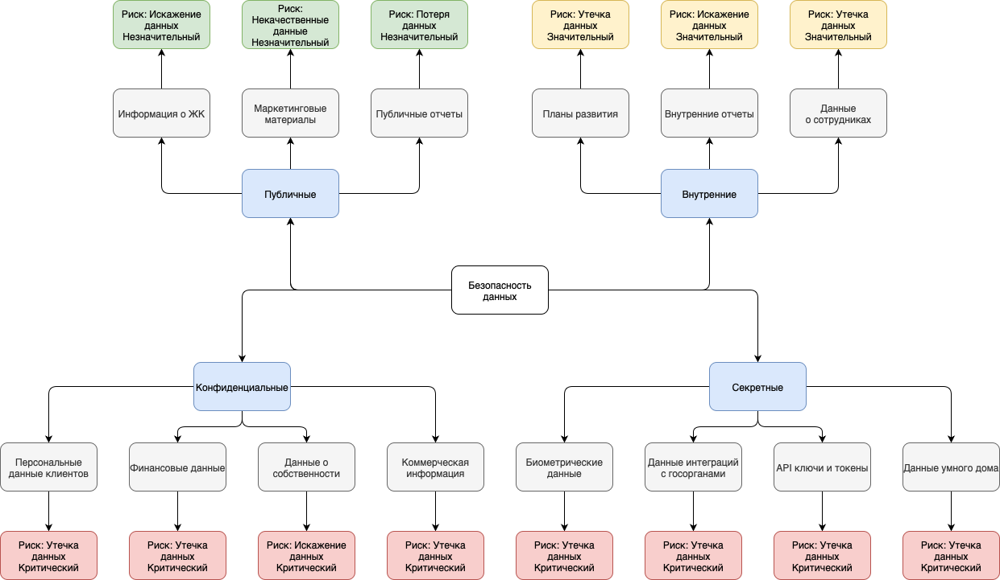

# Классификация данных по безопасности для PropDevelopment

### 1. Публичные данные
**Характеристика**: Данные, которые можно свободно распространять без ущерба для компании.

**Типы данных**:
- Общая информация о жилых комплексах
- Маркетинговые материалы
- Публичные отчеты компании

**Основные риски**:
- Искажение данных - может повлиять на репутацию
- Некачественные данные - снижает эффективность маркетинга
- Потеря данных - низкий риск, данные легко восстанавливаются

### 2. Внутренние данные
**Характеристика**: Данные для внутреннего использования компании.

**Типы данных**:
- Стратегические планы развития
- Внутренние отчеты и аналитика
- Данные о сотрудниках (не персональные)

**Основные риски**:
- Утечка данных - может дать преимущество конкурентам
- Искажение данных - влияет на принятие решений
- Некачественные данные - снижает эффективность управления

### 3. Конфиденциальные данные
**Характеристика**: Данные, требующие защиты согласно законодательству.

**Типы данных**:
- Персональные данные клиентов
- Финансовые данные
- Данные о собственности
- Коммерческая информация

**Основные риски**:
- Утечка данных - штрафы, потеря репутации
- Искажение данных - юридические последствия
- Потеря данных - нарушение обязательств перед клиентами

### 4. Секретные данные
**Характеристика**: Данные наивысшего уровня конфиденциальности.

**Типы данных**:
- Биометрические данные
- Данные интеграций с госорганами
- Ключи API и токены
- Данные систем безопасности

**Основные риски**:
- Утечка данных - критические последствия для безопасности
- Искажение данных - нарушение работы систем безопасности
- Потеря данных - невозможность восстановления некоторых данных
