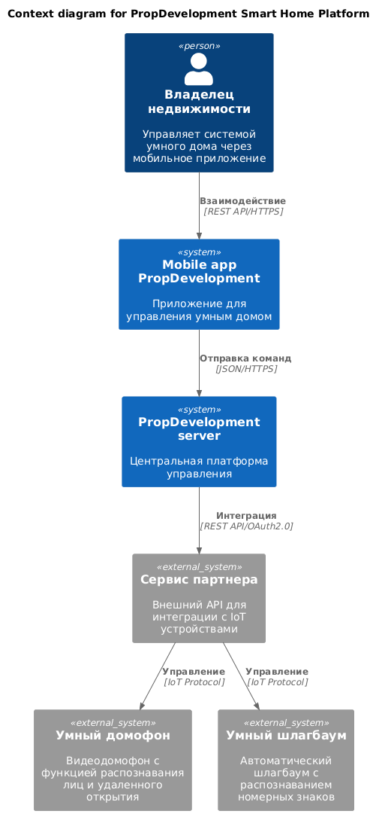
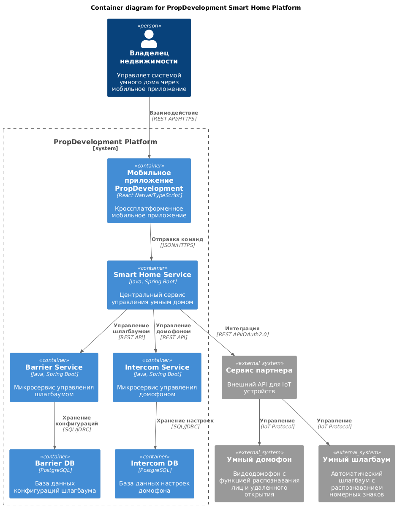
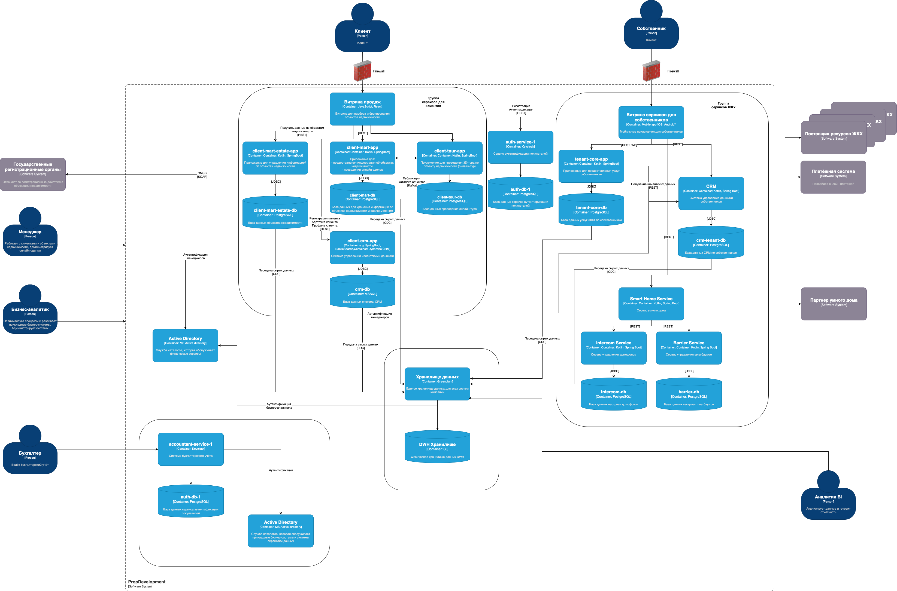

## Расширение платформы PropDevelopment Smart Home

### Диаграмма контекста (C4 — Level 1)
Файл `Task3/context.puml` иллюстрирует верхнеуровневые связи.

* **Владелец недвижимости** взаимодействует с **мобильным приложением PropDevelopment** (REST API/HTTPS).  
* Приложение делегирует команды на **PropDevelopment Server**, который, в свою очередь, интегрируется через безопасный канал **REST API + OAuth 2.0** с **партнёрским сервисом IoT**.  
* Партнёр управляет физическими устройствами (умный домофон и шлагбаум) по внутреннему IoT-протоколу.  

Таким образом, PropDevelopment остаётся «единым окном» для клиента, а партнёр полностью скрыт за границей предприятного периметра.

### Диаграмма контейнеров (C4 — Level 2)
Файл `Task3/container.puml` описывает изменения ландшафта PropDevelopment.

| Новый/изменённый контейнер | Технологии | Назначение |
|---------------------------|------------|------------|
| **Smart Home Service** | Java 17, Spring Boot | Шлюз и оркестратор умного дома; публикует REST API для мобильного приложения. |
| **Intercom Service** | Java 17, Spring Boot | Микросервис управления домофонами; хранит настройки в `intercom-db` (PostgreSQL). |
| **Barrier Service** | Java 17, Spring Boot | Микросервис управления шлагбаумами; использует `barrier-db` (PostgreSQL). |
| **Интеграционный модуль** (в составе Smart Home Service) | Spring Security + WebClient | Реализация OAuth 2.0 Client Credentials; формирует запросы к партнёру. |

> **Что осталось неизменным**  
> * Существующие клиентские приложения (React Native) и внутренние системы CRM, billing и т.д.  
> * Корпоративная шина/сервис discovery, если она уже применялась.

**Потоки данных**

1. *Мобильное приложение* → `Smart Home Service` — JSON/HTTPS  
2. `Smart Home Service` → `Intercom/Barrier Service` — REST (локальный сегмент) или gRPC  
3. `Smart Home Service` → **Партнёр** — REST API + OAuth 2.0 (по mTLS)  
4. `Intercom/Barrier Service` ↔︎ свои БД — JDBC/SQL  

### Обновленная C4-модель

### Требования к внешним интеграциям

| Категория | Требование |
|-----------|------------|
| **Защита канала** | • TLS 1.3 со строгими шифрами • Обязательный **mTLS** между PropDevelopment и партнёром (аутентификация сервера и клиента сертификатами). |
| **Аутентификация** | • **OAuth 2.0 Client Credentials** для machine-to-machine. • Access-токены JWT, время жизни ≤ 10 мин. • Scope-based ACL: `intercom:open`, `barrier:open`, `device:read` и т.п. |
| **Авторизация** | • Smart Home Service проверяет права владельца (RBAC) до вызова партнёра. • Партнёр проверяет scope токена, Device ID и список разрешённых действий. |
| **Нотация API** | • REST + JSON, версии в URI: `/api/v1/intercom/{id}/open`. • Idempotency-Key для критических POST. • Rate Limit и Retry-After в заголовках. |
| **Конфиденциальность данных** | • Персональные данные (ФИО, фото, номера авто) передаются **только** хэши/ID; биометрия хранится на стороне партнёра. • Шифрование «данных в покое» (PostgreSQL → TDE). |
| **Логирование и SIEM** | • Корреляционный ID по всем hop’ам. • Аудит-логи доступа к устройствам ≥ 5 лет. • Интеграция с централизованным SIEM (Syslog → Graylog/Splunk). |
| **Сетевое разделение** | • Выделенный DMZ-сегмент для внешних вызовов. • Входящие IP-white-list от партнёра. |
| **Надёжность** | • Circuit Breaker при обращении к партнёру (Resilience4j). • Квоты / ограничение на открытие одной двери ≤ 1 р/сек. |
| **Наблюдаемость** | • OpenTelemetry traces от мобильного клиента до партнёра. • Метрики SLA: P95 latency ≤ 500 мс, Availability ≥ 99.9 %. |
| **Управление версиями** | • Breaking changes только в / v2, уведомление за 90 дней. • Feature flags для постепенного включения новых функций. |
